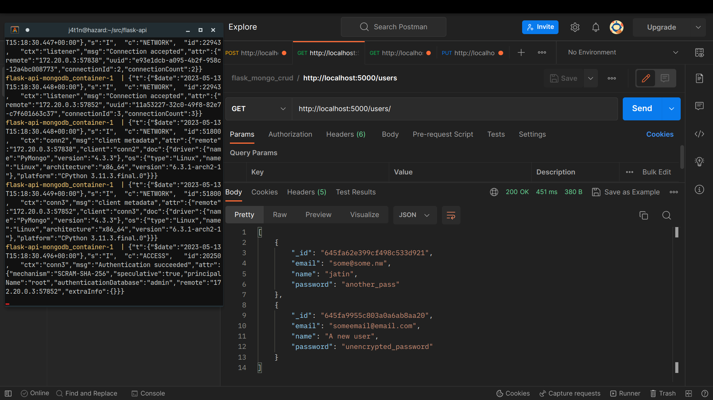
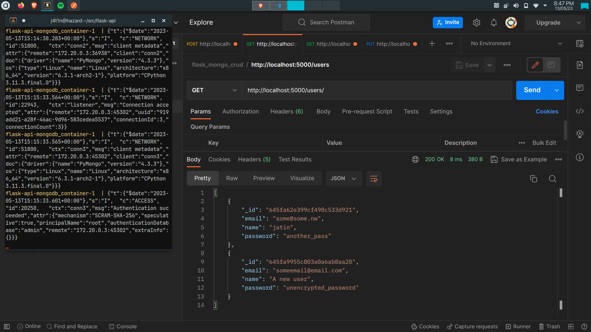

# Flask MongoDB CRUD Application

## Setup
### Using docker
```
docker-compose up
```

And that's it, you can now reach the api at http://localhost:5000/users

### Manual
Use the pipfile provided or install packages using requirements.txt. This method assumes you have a instance of mongodb setup and reachable.
```
pip install -r ./app/requirements.txt

export MONGODB_USERNAME=<mongodb user>
export MONGODB_PASSWORD=<mongodb password>
export MONGODB_HOSTNAME=<address of the mongo instance>

cd app
python main.py

```

## Endpoints
* GET /users/ - Returns a list of all users.
* GET /users/`<id>`/ - Returns the user with the specified ID.
* POST /users/ - Creates a new user with the specified data.
* PUT /users/`<id>`/ - Updates the user with the specified ID with the new data.
* DELETE /users/`<id>`/ - Deletes the user with the specified ID.

## Screenshots
### Post

### Get


## Video Link
https://drive.google.com/file/d/1JbcBLsr9-lkzulWy3phzlSALJhAdcndE/view?usp=sharing
